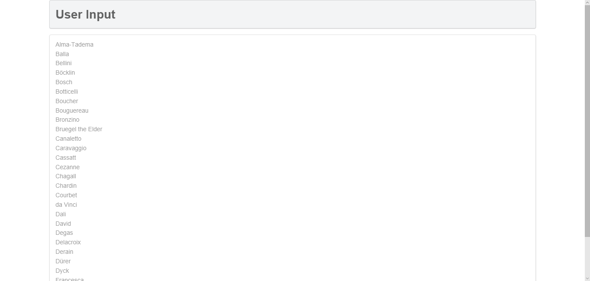

# lab10设计文档
## 7.
### lab10-exercise7-pdo.php
PDO访问数据库，显示Artist表中所有记录的ArtistID，按LastName排序

### lab10-exercise7-mysqli.php
MySQLi访问数据库，升序显示Genres表中所有GenreName，用GenreID作为选项的value

## 8.
### markup
在页面中插入动态生成的Artist链接和相应的Painting

### outputPaintings
根据点击的链接，查询ArtistID对应的所有Painting，用outputSinglePainting()输出
### outputSinglePainting
根据$row生成一个Painting的HTML

## 9.
### 使用连接对象的query()方法
返回查询结果集或FALSE，多用于查询语句
### 使用连接对象的exec()方法
返回受影响的行数
### 使用语句对象的execute()方法
用于支持预处理语句

安全性更好，需要多次提交情况下性能更好

需要分阶段或多步调用实现

通过位置占位符（或命名占位符）和bindValue()实现
## 10.
显示所有Genre的链接，点击后由genre.php提供详细信息

### outputGenres
访问数据库，调用outputSingleGenre()显示每一条记录
### outputSingleGenre
根据传入的记录，生成相应的HTML
### constructGenreLink
生成超链接提供给outputSingleGenre()