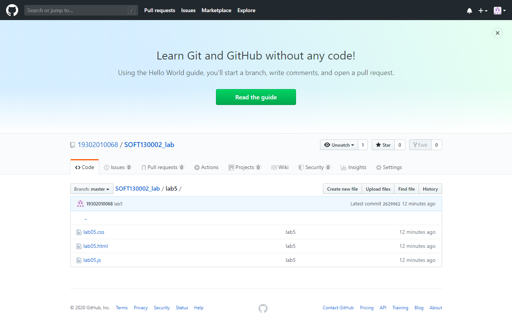

# lab5设计文档
## 1.
name参数应该以?或&开头，以&或字符串末端结尾，中间是name=value。据此用substring()提取value。
## 2.
涉及到函数是对象，将函数的引用作为事件处理函数的参数。

分别用setInterval()和setTimeout()实现多次运行和整分钟停止。用Date.now() % 60000取得一分钟内的毫秒数。

在timeTest下定义了counter和clear属性。counter用于记录函数运行次数，clear指向一个移除事件处理器的字面量函数。这增强了功能中各变量的关联，也防止污染全局命名空间。
## 3.
先遍历字符串，用chars和times数组存储各个字符及其出现次数，再查找其中的最大值。
## 截图
GitHub

网页效果

