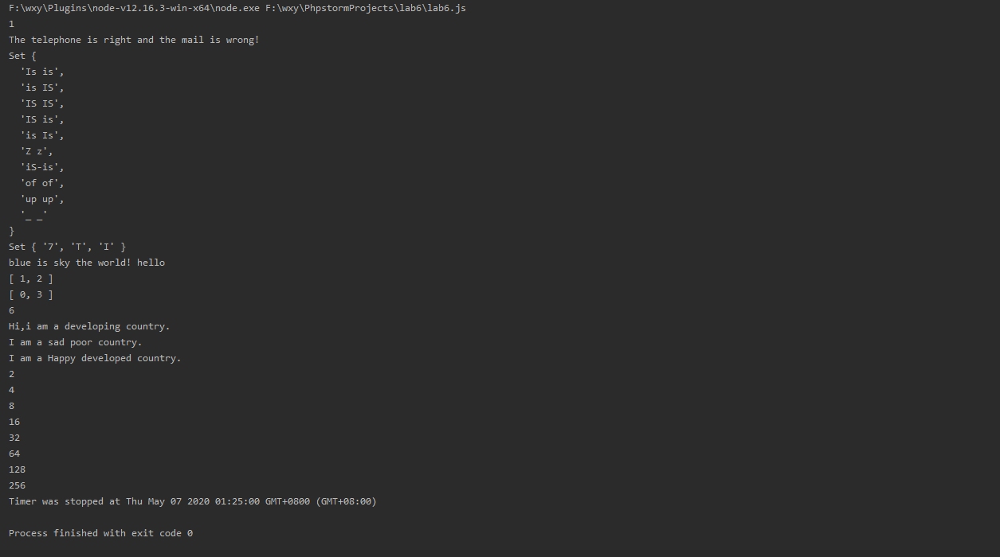

# lab6设计文档
## 各个正则表达式的解释
### testMail
移动手机电话显然必须以1开头，后面是10位数字。并且不能包含其他内容。所以是`/^1\d{10}$/`。

邮箱字符串中，基础的字符是字母、数字、下划线，也就是\w。@前面是邮箱名，后面是域名。多级域名之间用.分隔，也允许只有一级域名。所以是`/^\w+@\w+(\.\w+)*$/`。
### testRedundancy
这里需要执行不区分大小写的全局匹配。英文单词是\w+，中间的分隔是\W+。第二个单词要与第一个单词一致，所以是`/(\w+)\W+\1/gi`。

发生匹配时，lastIndex会跳过这里的第二个单词。但是如果使用(?=\1)会得不到第二个单词。所以还是采用每次匹配后lastIndex扣除\1这一部分的方法，也就是扣除(\w+)的长度。
## 继承不同方式的理解
### 借助构造函数
在用new调用构造函数的过程中，新建对象、设定__proto__指针都是new运算符完成的功能，而构造函数只是给新对象的属性赋值，它也不过是个普通的函数。基于这一原理，借助构造函数就是在创建完子类对象后，以新对象为this指针调用父类构造函数，为子类对象添加父类实例属性，实现继承。
### 原型链
把子类的原型设为父类的实例，这样子类原型的__proto__指向父类原型；子类实例的__proto__又指向子类原型。这样就串起了原型链，子类实例可以在父类原型和子类原型上共享属性和方法。但是对子类实例来说，父类构造函数是被完全屏蔽的，就不能方便地设定父类实例属性，只能在子类原型上共享，或者手动添加这些属性。
### Object.create
作为原型式继承的标准化方式，Object.create是彻底抛弃了构造函数，只谈对象。对象之间仅凭__proto__指针联系，并且共享原型链上的所有属性和方法。但是Object.create这个函数实在是不太好用，它的第二个参数用的是类似Object.defineProperties的语法，如果想要取得正常的添加属性的效果，就要手动写好writable，enumerable，configurable都是true，不仅非常麻烦，而且PhpStorm不能正确理解我写了什么，它会提示sayHappy不是一个方法。所以我觉得Object.create的第二个参数也应该提供类似Object.assign的语法，这样可以直接用对象字面量的方式给子类对象添加属性和方法。
## Map、Set、Array之间的区别和使用
### Array
Array是个最常见的数据结构，用于存放一组相关的变量，并且提供了丰富的操作方法。
### Set
Set存放的是不重复的数据，相当于Array中把重复项删掉，剩下的按原来的顺序组成的一组数据。
### Map
Map存放的是键值对。如果把Map作为类似Array的数据结构来用，那么Map是强化了下标，因为Array的sort等操作体现了它的无序性。Map也相当于下标可以不连续的数组，如果下标很分散，用Array就会浪费内存，此时Map就比较合适。
## 截图
GitHub

命令行

